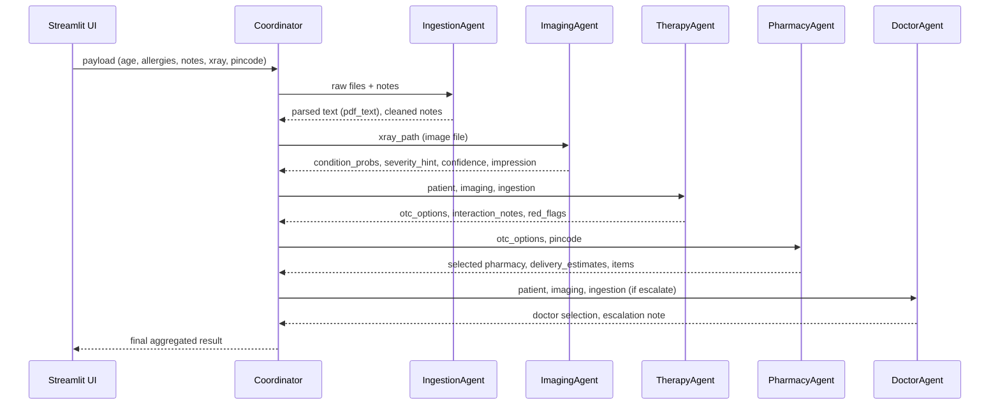

# Multi-Agent Healthcare Assistant (Demo)

**Disclaimer:** Educational demo only. Not medical advice.

## Overview
This project is a proof-of-concept multi-agent system simulating a healthcare assistant.  
It demonstrates ingestion of clinical artifacts, lightweight triage, OTC therapy suggestions, pharmacy matching, and optional doctor escalation.

## Features
- **Ingestion Agent**: Validates uploads, extracts text, masks PII.
- **Imaging Agent**: Dummy classifier for chest X-rays (rule-based stub).
- **Therapy Agent**: Maps conditions to OTC options, checks interactions, generates advice with Gemini LLM.
- **Pharmacy Agent**: Matches to nearest pharmacy with stock from dummy data.
- **Doctor Agent**: Escalates to mock doctor roster when red flags or low confidence.
- **Coordinator**: Orchestrates the workflow and logs events.

# Healthcare Assistant — Project README

## Table of contents

- Project Overview
- Architecture & High-level Flow
	- Sequence Diagram (Mermaid)
	- Component Responsibilities
- Data layer
	- Files and schemas
	- How data is consumed
- Agents (detailed)
	- Base agent contract
	- IngestionAgent
	- ImagingAgent
	- TherapyAgent
	- PharmacyAgent
	- DoctorAgent
	- Coordinator/Orchestrator
- Events and Telemetry
	- Event shape
	- Example events
- Configuration & Secrets
	- `config/settings.yaml`
	- Streamlit secrets & environment variables
- UI (`app.py`)
	- Flow and session state
	- Booking demo behavior
- Tests
	- Test structure and what to run
- Development & Contribution
	- Running locally
	- Linting, formatting and tests
	- Adding a new agent
- Troubleshooting & Debugging
- Security and Data Privacy
- Appendix
	- Example payloads
	- Example agent outputs


---

## Project Overview

Healthcare Assistant is an educational multi-agent demonstration written in Python that performs basic triage and treatment suggestions for chest X-rays and simple symptom inputs. It is not for real medical use. The project is structured around small "agents" that each perform a focused task (ingestion, imaging analysis, therapy recommendation, pharmacy matching and doctor selection). A central coordinator orchestrates these agents and returns a consolidated result to the Streamlit demo UI.

Key goals of the project:
- Show a modular agent-based architecture that can be extended.
- Demonstrate simple rules + LLM assisted escalation (doctor note generation).
- Provide safe, OTC-only medication suggestions and escalation when red-flags are detected.
- Integrate simple pharmacy matching for OTC fulfillment.

Project layout (top-level):

- `app.py` — Streamlit demo UI and entry point for user interactions.
- `agents/` — Agent implementations: ingestion, imaging, therapy, pharmacy, doctor, coordinator.
- `orchestrator/` — Router / events utilities used by coordinator and agents.
- `models/` — Local stubs / model helpers for imaging.
- `data/` — CSV/JSON files (doctors, meds, inventory, pharmacies, zipcodes, medical rules).
- `tests/` — Pytest suite for core behaviors.
- `utils/` — Configuration, logging and security helpers.


## Architecture & High-level Flow

At a high level, the system follows this flow:

1. UI (`app.py`) collects patient info, X-ray image and optional files.
2. The Coordinator packages that payload and calls each agent in sequence (or parallel where applicable): Ingestion → Imaging → Therapy → Pharmacy → Doctor.
3. Each agent returns a structured result and emits events describing its steps.
4. The Coordinator aggregates agent outputs and events and returns a final `result` object stored in Streamlit session state and displayed to the user.

Sequence diagram (Mermaid):



Component responsibilities (short):
- IngestionAgent (`agents/ingestion_agent.py`)
	- Parse PDF reports, extract text from uploads, normalize notes.
- ImagingAgent (`agents/imaging_agent.py`, `models/imaging_stub.py`)
	- Run an X-ray classifier (or a stub) to infer condition probabilities, severity and confidence.
- TherapyAgent (`agents/therapy_agent.py`)
	- Apply medical rules and drug interactions to produce OTC recommendations and detect red flags.
- PharmacyAgent (`agents/pharmacy_agent.py`)
	- Map recommended meds to inventory, match with nearby pharmacies by pincode, compute delivery estimates and fees.
- DoctorAgent (`agents/doctor_agent.py`)
	- Select the best suited doctor from `data/doctors.csv` (rule-based), optionally generate an LLM escalation note.
- Coordinator (`agents/coordinator.py`)
	- Runs the agents in the right order, collects events and shapes the final result for the UI.


## Data layer

All static data and corpora live under `data/`.

Important files (with typical schema):

- `data/doctors.csv` — list of doctors and attributes
	- Typical columns: `doctor_id`, `name`, `specialty`, `rating`, `experience_years`, `tele_slot_iso8601`, `location`, `consultations`.
	- Used by `DoctorAgent` for matching and sorting.

- `data/inventory.csv` — pharmacy inventory mapping
	- Typical columns: `pharmacy_id`, `sku`, `product_name`, `price`, `qty` (stock), `otc` (boolean), etc.
	- Normalized by `PharmacyAgent` on load; columns such as `stock` may be remapped to `qty`.

- `data/meds.csv` — medication metadata
	- Columns: `drug_name`, `sku`, `dose`, `freq`, `otc`, `warnings`, etc.
	- Used by `TherapyAgent` to produce user-friendly OTC options.

- `data/pharmacies.json` — geo info and addresses for pharmacies
	- Includes `pharmacy_id`, `name`, `lat`, `lon`, `pincodes_covered`.

- `data/zipcodes.csv` — mapping pincode -> lat/lon for distance calculations.

- `data/medical_rules.json` — domain rules for red-flag detection and therapy filtering
	- Contains rules such as symptom keywords mapped to specialties, red-flag phrases, and threshold values.

Note on editing data files
- When adding or editing rows in CSVs, preserve header order. Some agents expect certain column names; if you change names, update the agent code where the column is referenced.


## Agents (detailed)

This section documents the expected contract (inputs/outputs), major responsibilities, and code location for each agent.

### Base agent contract (`agents/base.py`)

All agents implement a `run(payload: dict) -> dict` interface. The base class provides helper utilities and an `AgentResult` wrapper.

Contract (informal):
- Input: `payload` dictionary. Common keys: `patient`, `xray_path`, `xray_report_path`, `notes`, `pincode`, `ingestion` (optional), etc.
- Output: an agent-specific dictionary. Agents should always return a dictionary (no exceptions bubbled to the caller); on error they include `{"error": "..."}` and may emit an `events` entry.

Common event emission:
- Agents append structured events to an `events` list with fields `{ timestamp, agent, type, data }` so the Coordinator and UI can show a timeline.

Example output shape (generic):
```json
{
	"agent": "therapy",
	"otc_options": [ ... ],
	"interaction_notes": [ ... ],
	"red_flags": [ ... ],
	"warnings": [ ... ]
}
```


### IngestionAgent (`agents/ingestion_agent.py`)

Purpose:
- Extract text from uploaded PDFs and images (radiology reports, prescriptions).
- Normalize user-entered notes into tokens and keywords for downstream agents.

Inputs:
- `payload` with `xray_report_path`, `prescription_path`, `notes`.

Outputs:
- `{"pdf_text": "...", "notes_tokens": [...], "metadata": {...}}`

Code references:
- See `agents/ingestion_agent.py` for extraction and cleanup helpers.

Notes:
- Extracted text is consumed by `DoctorAgent` (keyword matching) and `TherapyAgent` (red-flag phrase detection).


### ImagingAgent (`agents/imaging_agent.py` and `models/imaging_stub.py`)

Purpose:
- Analyze chest X-ray images and return condition probabilities, severity estimation and a confidence score.

Inputs:
- `payload` with `xray_path` (path to the uploaded image).

Outputs (typical):
```json
{
	"condition_probs": {"pneumonia": 0.42, "covid": 0.05, "pleural_effusion": 0.02},
	"severity_hint": { "total": 3, "mapped_label": "moderate" },
	"confidence": 0.78,
	"impression": "Cardiomegaly suspected, consider clinical correlation",
	"image_estimates": { ... }
}
```

Code references:
- `models/imaging_stub.py` contains a local stubbed predictor used for testing and development. Replace this with an actual model or cloud API for production.
- `agents/imaging_agent.py` is the agent wrapper that converts model outputs into the agent contract.

Notes:
- `TherapyAgent` uses `condition_probs` and `confidence` to decide whether to escalate (for example, confidence > 0.6 or severe mapped severity will flag for escalation).


### TherapyAgent (`agents/therapy_agent.py`)

Purpose:
- Produce safe, over-the-counter (OTC) medication suggestions.
- Run red-flag logic that may suppress OTC suggestions and trigger escalation.

Inputs:
- `payload` with `patient` (age, allergies), `ingestion` (pdf_text), `imaging` (from ImagingAgent).

Outputs (typical):
```json
{
	"otc_options": [ {"drug_name": "Paracetamol", "dose": "500mg", "freq": "q6h", "sku": "OTC001" }, ... ],
	"interaction_notes": ["Avoid mixing with ..."],
	"red_flags": ["High severity chest findings", "age > 65"],
	"warnings": [ ... ]
}
```

Key behaviors:
- Value-driven filtering: the agent consults `data/meds.csv` and `data/medical_rules.json`.
- Interaction checks: text-based lookup for contraindications and allergies.
- Red-flag detection: checks symptom keywords, imaging impressions and model `confidence` thresholds (configurable), and severity mappings. If red flags exist, OTC options are suppressed and warnings are returned.


### PharmacyAgent (`agents/pharmacy_agent.py`)

Purpose:
- Map `otc_options` to actual `inventory` SKUs available at nearby pharmacies and estimate delivery time & fees.

Inputs:
- `payload` with `otc_options`, `pincode` (delivery pincode) and optionally `patient`.

Outputs (typical):
```json
{
	"pharmacy_id": "ph001",
	"pharmacy_name": "MedQuick Pharmacy",
	"distance_km": 2.4,
	"delivery_time": {"processing_time": {"min": 5, "max": 10}, "travel_time": 25, "total_time": {"min": 30, "max": 35} },
	"delivery_fees": {"base_fee": 30, "distance_fee": 20, "total": 50},
	"items": [ {"sku": "OTC001", "qty": 1, "price": 45}, ... ]
}
```

Key behavior & code references:
- Inventory normalization: the agent normalizes columns such as `stock` to `qty` on load and ensures `pharmacy_id` is a string.
- Partial fulfillment: configurable via a flag (see `agents/pharmacy_agent.py`).


### DoctorAgent (`agents/doctor_agent.py`)

Purpose:
- Choose a doctor best suited for the case and provide an escalation note (optionally by calling an LLM).

Inputs:
- `payload` with `patient`, `imaging`, `ingestion`, and collection of rules.

Outputs (typical):
```json
{
	"doctor": {"doctor_id": "d010", "name": "Dr. A. Singh", "specialty": "Pulmonology", "tele_slot_iso8601": "2025-10-14T10:30:00Z"},
	"escalation_note": "Short note to the doctor..."
}
```

Selection logic
- The agent runs a deterministic rule-based selection using:
	- Age-based routing (e.g., Pediatrics if age <= 16, Geriatrics if >= 65).
	- Specialty inference using symptom keywords, `pdf_text` and imaging impressions.
	- A scoring heuristic: specialty match, rating/experience, number of prior consultations, proximity (if present).

Debugging
- `DoctorAgent` emits a `selection_debug` event containing `effective_specialty` and candidate list to help trace decision-making.

LLM
- If escalation is required, the agent may call an LLM (Gemini API key required) to synthesize an escalation note. The key is read from environment or Streamlit secrets (see Configuration below).


### Coordinator / Orchestrator (`agents/coordinator.py` and `orchestrator/`)

Purpose:
- Orchestrate agent execution, enforce ordering, aggregate results and collate `events` into a final `result` structure.

Key responsibilities:
- Call `IngestionAgent` first to get textual inputs.
- Call `ImagingAgent` to get image analysis.
- Call `TherapyAgent` (uses ingestion + imaging outputs).
- Call `PharmacyAgent` with recommended OTC options to fetch delivery info.
- Decide if a `DoctorAgent` run is needed for escalation and ensure `escalation` details are always included in the final result (the UI expects `result['escalation']['doctor']`).
- Return a final result with keys: `imaging`, `therapy`, `pharmacy`, `escalation`, and `events`.


## Events and Telemetry

Agents emit events which the UI shows under "Technical Details". The `events` list is an ordered timeline of agent actions.

Event shape (typical):
```json
{
	"timestamp": "2025-10-14T10:11:12.345678",
	"agent": "therapy",
	"type": "red_flags_detected",
	"data": {"red_flags": ["severe opacities in xray", "age > 65"]}
}
```

Common event `type` values:
- `ingestion:pdf_extracted`
- `imaging:analysis_completed`
- `therapy:red_flags`
- `pharmacy:matched`
- `doctor:selection_debug`


## Configuration & Secrets

### `config/settings.yaml`

This file holds runtime configuration such as data paths and thresholds. Example sections you might find:

- `paths.data` — paths to CSV/JSON in `data/`
- `medical.red_flag_confidence_threshold` — confidence threshold used by `TherapyAgent`.
- `pharmacy.allow_partial_fulfillment` — whether partial orders are allowed.

If you change thresholds or paths, restart the Streamlit app.

### Streamlit secrets and environment variables

- `GEMINI_API_KEY` (or `GEMINI_API_KEY` in `.streamlit/secrets.toml`) — required for LLM escalation note generation.
- The repo intentionally does not track `.streamlit/secrets.toml`. Add your API key locally in that file or set the environment variable.

Example `.streamlit/secrets.toml` (local only):

```toml
GEMINI_API_KEY = "YOUR_API_KEY_HERE"
```

Security note: Never commit secrets to the repository. The project adds `.streamlit/secrets.toml` to `.gitignore`.


## UI (`app.py`)

`app.py` is a Streamlit application that:
- Collects patient info (age, allergies, notes), uploads for X-ray image and PDFs, and a pincode for delivery.
- On form submit, saves uploads under `uploads/` and constructs a payload for the `Coordinator`.
- Calls `coord.run(payload)` and saves the `result` into `st.session_state['result']`.
- Renders the following sections when an assessment is present: Initial Analysis (imaging), Recommended Care (therapy), Pharmacy & Delivery, Doctor Escalation and Technical Details (events).

Booking demo
- The UI includes a simple booking demo under the Doctor section. When the user submits the booking form, booking info is saved to `st.session_state` (e.g., `doctor_booking`, `doctor_booked`) and the UI triggers a rerun with `st.rerun()` (wrapped in try/except for compatibility).

Important UI state keys:
- `st.session_state['result']` — last coordinator output
- `st.session_state['assessment_done']` — boolean flag for whether to show results
- `st.session_state['order_confirmed']` & `order_details` — pharmacy order
- `st.session_state['doctor_booking']` & `doctor_booked` — booking demo


## Tests

Tests are in the `tests/` directory and use pytest. Key tests:
- `tests/test_handshakes.py` — general agent handshake tests
- `tests/test_imaging_stub.py` — validates imaging stub behavior
- `tests/test_interactions.py` — checks interaction and OTC mapping logic
- `tests/test_order_flow.py` — end to end therapy -> pharmacy order flows
- `tests/test_pharmacy_agent.py` — pharmacy matching and inventory
- `tests/test_therapy_agent.py` and `tests/test_therapy_filtering.py` — therapy red-flag and filtering
- `tests/test_doctor_selection.py` — deterministic doctor selection

Run tests (PowerShell example):

```powershell
.\.\venv\Scripts\Activate.ps1
pytest -q
```


## Development & Contribution

Getting started locally
1. Create and activate a virtual environment (Python 3.10+ recommended):

```powershell
python -m venv venv
.\venv\Scripts\Activate.ps1
pip install -r requirements.txt
```

2. Set secrets
- Add `GEMINI_API_KEY` in `.streamlit/secrets.toml` (local only) or export as environment variable.

3. Run Streamlit UI

```powershell
streamlit run app.py
```

Coding standards
- Follow existing project style. Use `black`/`flake8` if available.
- Add tests when you add or change behavior.

Commit & push rules
- Avoid committing `.streamlit/secrets.toml`. Add new secret patterns to `.gitignore` if needed.
- When rebasing or force-pushing, use `--force-with-lease` to avoid overwriting others' work.

Adding a new agent
1. Create a new file under `agents/`, e.g. `agents/my_agent.py`.
2. Implement a `run(payload: dict) -> dict` method and emit events through the coordinator's event mechanism.
3. Update `agents/coordinator.py` to call the new agent where appropriate and include its output in the final `result`.
4. Add unit tests under `tests/` covering happy and failure paths.


## Troubleshooting & Debugging

Common issues and how to approach them:
- AttributeError: module 'streamlit' has no attribute 'experimental_rerun'
	- Use `st.rerun()` instead and wrap in try/except for compatibility across Streamlit versions. See the updated `app.py` booking logic.

- Tests failing after interface changes
	- Check for contract mismatches: agent outputs must remain dicts and contain expected keys. Use `tests/` to identify which agent's contract changed.

- LLM calls failing
	- Ensure `GEMINI_API_KEY` is set in environment or `.streamlit/secrets.toml`.

- Secrets accidentally committed
	- Remove from git with `git rm --cached <file>` and add to `.gitignore`. Rotate any exposed keys.


## Security and Data Privacy

This project is a demo and is not intended for production or to handle PHI. Safety steps implemented:
- No PHI is persisted remotely by default; uploaded files are currently saved under `uploads/` locally.
- All medication suggestions are limited to OTC options; red-flag logic suppresses OTCs when severe signs are present.
- Use local secrets for API keys and do not commit them.


## Appendix

### Example payload sent to Coordinator

```json
{
	"patient": {"age": 45, "allergies": ["ibuprofen"]},
	"xray_path": "uploads/xray_123.png",
	"xray_report_path": "uploads/report_123.pdf",
	"prescription_path": null,
	"notes": "cough, low-grade fever",
	"pincode": "400053"
}
```

### Example final result (simplified)

```json
{
	"imaging": { "condition_probs": {"pneumonia": 0.42}, "severity_hint": {"total": 3, "mapped_label": "moderate"}, "confidence": 0.78 },
	"therapy": { "otc_options": [ {"drug_name":"Paracetamol","sku":"OTC001","dose":"500mg"}], "red_flags": [] },
	"pharmacy": { "pharmacy_name": "MedQuick", "delivery_time": {"total_time": 35}, "items": [...] },
	"escalation": { "doctor": {"name": "Dr. A. Singh","specialty":"Pulmonology","tele_slot_iso8601":"2025-10-14T10:30:00Z" }, "escalation_note": "..." },
	"events": [ ... ]
}
```


### Where to look for common edits
- UI: `app.py`
- Agent orchestration: `agents/coordinator.py`
- Doctor selection logic: `agents/doctor_agent.py`
- Imaging stub: `models/imaging_stub.py`
- Therapy red-flags and OTC mapping: `agents/therapy_agent.py`
- Pharmacy inventory matching: `agents/pharmacy_agent.py`


---

## Recent changes (what we implemented)

This project recently added several safety and workflow improvements focused on red-flag detection, clearer OTC recommendations, and delivery handling. The following is a concise summary of what was implemented, why, and where to look in the codebase.

1) Severity scoring and imaging red-flags
- Location: `models/xray_processor.py`, `agents/imaging_agent.py`
- What: left/right lung percent opacities are mapped into RALE-style buckets per lung (0-4). The agent computes a total score (0-8) and a percent severity = total/8. Imaging now raises red flags when percent >= 0.7 (70%).
- Also: imaging now inspects the radiologist impression and radiographic finding booleans (consolidation, pleural effusion, pneumothorax) and raises red flags for critical keywords.

2) OTC recommendation logic changes (therapy)
- Location: `agents/therapy_agent.py`, `data/medical_rules.json`
- What: OTC recommendations are now only produced when explicit evidence exists (symptoms, measurements, allergies). The agent:
	- Avoids silent fallbacks to condition-derived symptoms.
	- Collects safe medication lists per symptom and prefers medications that cover ALL detected symptoms (intersection-first). Falls back to union with a warning if necessary.
	- Filters meds by allergy keywords (from `data/medical_rules.json`) and age-group restrictions.
	- Checks drug-drug interactions from `data/interactions.csv` before finalizing options.

3) Pharmacy delivery fee & ETA calculations
- Location: `agents/pharmacy_agent.py`, `data/zipcodes.csv`, `data/pharmacies.json`
- What: Delivery fee now uses zone multipliers and distance-based fees. ETA uses zone-specific processing times and travel speeds. When combined red flags are present, the pharmacy agent selects express delivery (extra express fee) automatically.

4) Escalation & coordinator changes
- Location: `agents/coordinator.py`
- What: The Coordinator now aggregates red flags from both imaging and therapy into `combined_red_flags`, passes these to downstream agents (pharmacy and doctor), and includes them in the final result. Escalation logic now triggers when imaging red flags are present as well as therapy red flags or low imaging confidence.

5) UI changes
- Location: `app.py`
- What: The Streamlit UI now prominently displays `combined_red_flags` (imaging + therapy) in the Recommended Care panel. The order flow receives flags so that pharmacy can use express delivery when needed. Session state persists the final `result` to allow inspection and repeated testing.

6) Rule-driven red-flag configuration
- Location: `data/medical_rules.json`
- What: Added `red_flags` section that includes:
	- `symptoms`: a list of critical symptom keywords (e.g., chest pain, shortness of breath)
	- `measurements`: named measurement rules with `operator`, `threshold`, and `message` (e.g., SpO2 < 92 => urgent attention)

7) Tests
- Location: `tests/test_imaging_red_flags.py`
- What: New test that monkeypatches the xray processor to simulate severity 75% (6/8) and patient age 85, then asserts imaging agent sets `red_flags` and `red_flag_evidence`. Full test suite passes (20 tests on dev branch).

8) Repository housekeeping
- Removed accidental `tmp_x.png` and added it to `.gitignore`.

How to test these changes quickly
1. Run unit tests:

```pwsh
cd d:\DOWNLOADS\healthcare-assistant
pytest -q
```

2. Run the Streamlit demo locally and reproduce the scenario:

```pwsh
cd d:\DOWNLOADS\healthcare-assistant
streamlit run app.py
```

Fill the form with:
- Age: 85
- Allergies: ibuprofen
- Notes: cough, low-grade fever
- Upload a sample chest X-ray image and report (or use the sample files in `uploads/` if present)

Expected behavior:
- Imaging panel shows severity ~75% (Score: 6/8).
- An alert box under "Recommended Care" displays combined red flags (imaging score >=70% and age >=80 messages).
- Pharmacy shows express delivery fees & ETA.

Where to change thresholds and rules
- `data/medical_rules.json` is the single source for symptom keywords, allergy keywords, and measurement thresholds (SpO2, temperature). You may add imaging thresholds to this JSON later to make them configurable.

Next recommended tasks (optional):
- Promote imaging threshold and keyword lists into `data/medical_rules.json` (so non-code config controls escalation thresholds).
- Add tests for impression keyword triggers and coordinator escalation behavior.
- Improve `PharmacyAgent` peak-hour/adverse-weather logic using real data or toggles in `config/settings.yaml`.

---

If you'd like, I can:
 - Add UML/Graphviz diagrams as separate images checked into `docs/` for richer visuals.
 - Break this README into `docs/` pages (e.g., `docs/agents.md`, `docs/data.md`) and wire a small static site generator (MkDocs) for nicer browsing.
 - Create a CONTRIBUTING.md with git workflow rules and a small pre-commit hook to block committing secrets.
 - Tell me how you'd like the README expanded (e.g., more sequence diagrams per agent, concrete code snippets for each class, or adding a living architecture diagram) and I will update it.

---

If you'd like, I can:
- Add UML/Graphviz diagrams as separate images checked into `docs/` for richer visuals.
- Break this README into `docs/` pages (e.g., `docs/agents.md`, `docs/data.md`) and wire a small static site generator (MkDocs) for nicer browsing.
- Create a CONTRIBUTING.md with git workflow rules and a small pre-commit hook to block committing secrets.
- Tell me how you'd like the README expanded (e.g., more sequence diagrams per agent, concrete code snippets for each class, or adding a living architecture diagram) and I will update it.
